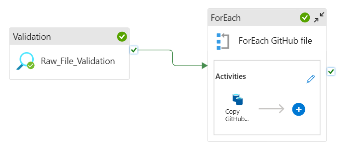
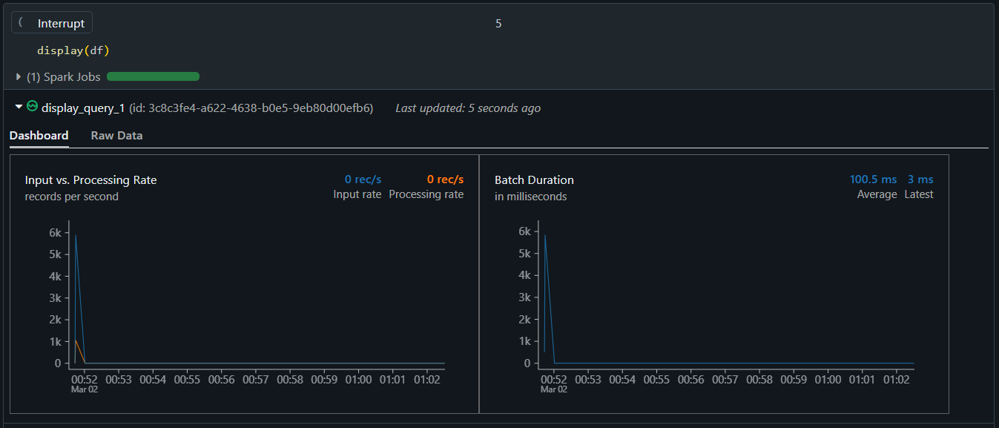
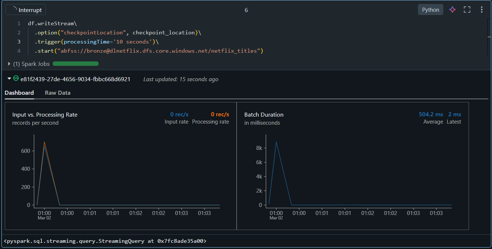

# Netflix Data Engineering Project

## Problem Statement

Netflix datasets are stored in both a GitHub repository and an Azure Data Lake. The business requirement is for the data engineer to build ETL pipelines to prepare and serve data to Azure Synapse Analytics and Power BI for further analysis and reporting. The client requires incremental data loads to be served in Azure Synapse Analytics and Power BI, where data analysts can access the data for further analysis and reporting.

## Business Requirements

1. **Data Integration:**
   - Integrate data from multiple sources (GitHub and Azure Data Lake) into a unified data platform.
   - Ensure data consistency and integrity during the ingestion process.

2. **Incremental Data Loads:**
   - Implement mechanisms to handle incremental data loads efficiently.
   - Ensure that only new or updated data is processed and ingested.

3. **Data Transformation:**
   - Cleanse, enrich, and transform raw data into meaningful datasets.
   - Apply business rules and logic to prepare data for analysis.

4. **Data Storage:**
   - Store data in a structured format to support efficient querying and analysis.
   - Implement a multi-layered storage architecture (bronze, silver, gold) to manage data at different stages of processing.

5. **Data Serving:**
   - Integrate with Power BI to provide interactive dashboards and visualizations for end-users.

## Objectives

1. **Data Ingestion from GitHub:**
   - Utilize Azure Data Factory (ADF) pipelines to orchestrate data ingestion from the GitHub repository.
   - Configure ADF to schedule and automate the data extraction process.

2. **Incremental Data Ingestion from Data Lake:**
   - Implement Databricks Autoloader to ingest data from the Azure Data Lake incrementally.
   - Ensure the Autoloader is set up to handle schema evolution and data changes efficiently.

3. **Bronze Storage Layer:**
   - Ingest raw data into the bronze storage layer, maintaining the original format and fidelity.
   - Use Delta Lake to manage the bronze layer, providing ACID transactions and scalable metadata handling.

4. **Silver Storage Layer Transformation:**
   - Apply transformations using Databricks PySpark to cleanse, enrich, and aggregate data in the silver storage layer.
   - Implement data quality checks and validation rules to ensure data integrity.

5. **Dynamic/Parameterized Notebooks:**
   - Develop dynamic and parameterized Databricks notebooks using workflow activities such as for loops and if-else conditions.
   - Ensure notebooks are modular and reusable, facilitating easier maintenance and updates.

6. **Gold Storage Layer and Star Schema:**
   - Create a star schema in the gold storage layer using ETL workflows in Delta Live Tables.
   - Design fact and dimension tables to optimize query performance and support analytical workloads.

7. **Data Serving:**
   - Serve the processed data to Azure Synapse Analytics for advanced analytics and reporting.
   - Integrate with Power BI to provide interactive dashboards and visualizations for end-users.

## Technologies to be Adopted

- **Azure Data Factory (ADF):** For orchestrating data ingestion from GitHub.
- **Databricks Autoloader:** For incremental data ingestion from Azure Data Lake.
- **Delta Lake:** For managing data storage layers (bronze, silver, gold) with ACID transactions.
- **Databricks PySpark:** For data transformation and processing in the silver storage layer.
- **Databricks Notebooks:** For developing dynamic and parameterized workflows.
- **Delta Live Tables:** For creating ETL workflows and star schema in the gold storage layer.

## Resources provisioning
- Create Azure resource group
- Create a Data Lake storage account and layers of storage
- Create Azure Data Factory
- Create linked services or connectors (Http and Azure Data Lake Gen 2)
- Create Azure Databricks
- Create Azure Databricks connector

## Pipeline activities
- Copy activity
- ForEach Activity
- Validation activity

## Autoloader results
 **Autoloader readStream result**

 **Autoloader writeStream result**

## DLT pipline results
 **DLT pipeline result to gold layer**

This approach ensures a robust and scalable data pipeline, leveraging Azure and Databricks capabilities to handle large-scale data processing and analytics.
